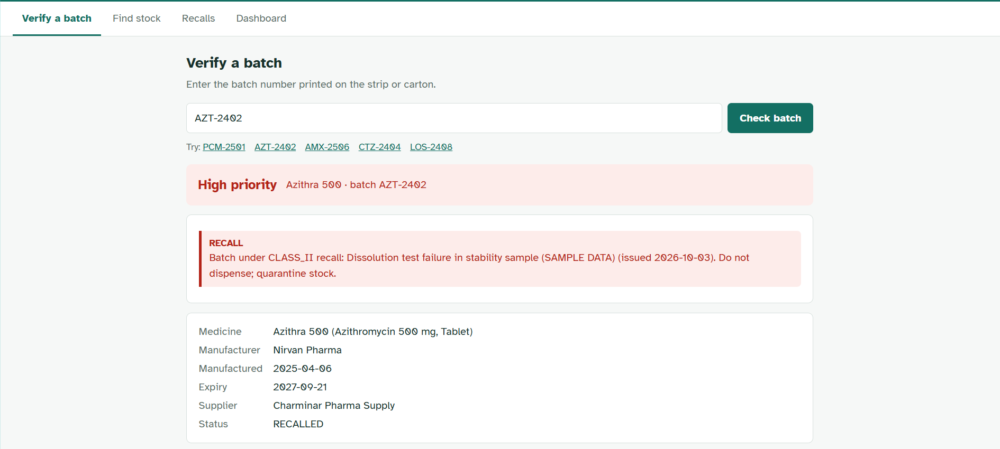
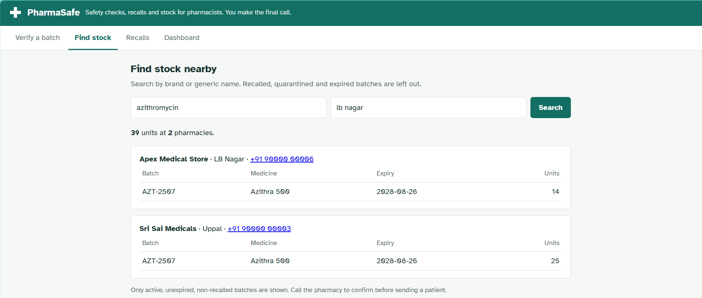
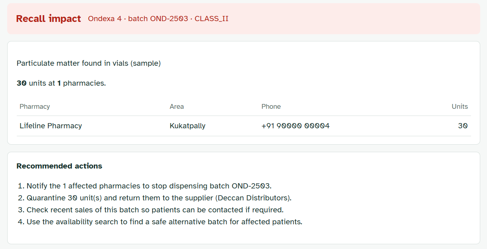
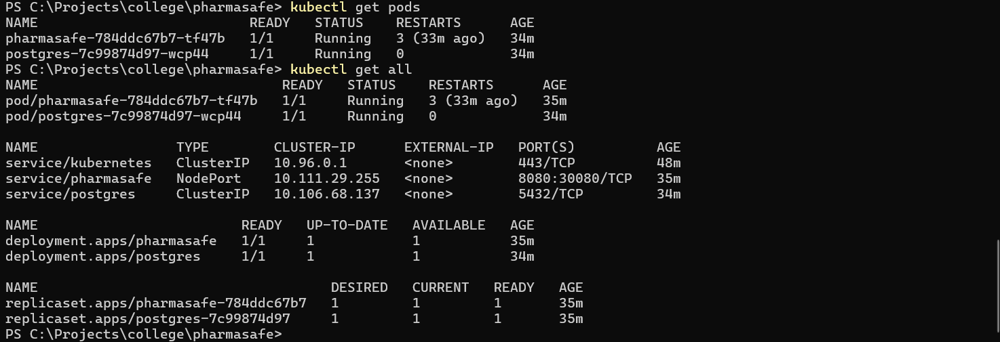
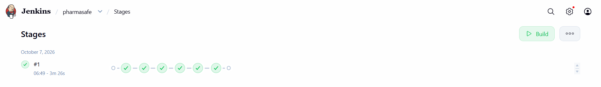
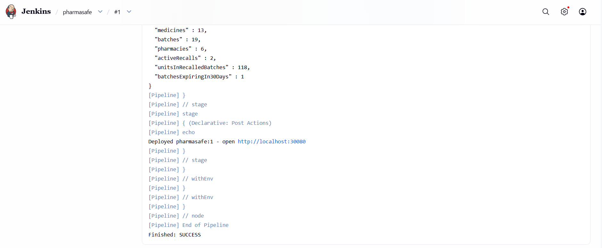
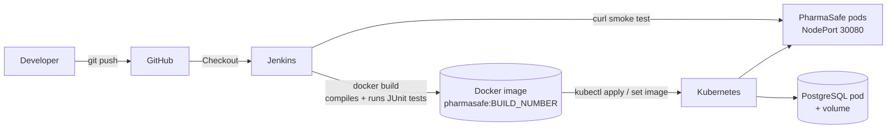

# PharmaSafe

A pharmacist-focused safety layer for medicine batches. It answers three questions at the counter:

1. **Is this batch safe to dispense?** It checks recalls, quarantine, expiry and look-alike names, and gives one clear risk level.
2. **A batch was just recalled. Who is holding it?** It lists the affected pharmacies, the unit counts and the next steps.
3. **We're out of stock. Who nearby has a safe batch?** It searches the network and leaves out recalled, quarantined and expired stock.

> **Scope boundary.** PharmaSafe does not replace a pharmacy management system, diagnose, prescribe or certify that a medicine is genuine. It gives pharmacists information to act on, and the final decision always stays with the pharmacist.

All data in this repository is **fictional sample data**: the brand names, pharmacies, phone numbers and recalls are all invented.

---

## Screenshots

| Batch check (recalled)                    | Stock search                         |
| ----------------------------------------- | ------------------------------------ |
|  |  |

| Recall impact                           | Running on Kubernetes             |
| --------------------------------------- | --------------------------------- |
|  |  |

| Jenkins pipeline                         | Jenkins console                           |
| ---------------------------------------- | ----------------------------------------- |
|  |  |

## Features (MVP)

| Module                      | What it does                                                                                          | Endpoint                                            |
| --------------------------- | ----------------------------------------------------------------------------------------------------- | --------------------------------------------------- |
| Medicine safety             | Checks a batch number and returns risk level `LOW` / `REVIEW_REQUIRED` / `HIGH_PRIORITY` with reasons | `GET /api/batches/{batchNumber}/verify`             |
| Batch traceability          | Lists the batches of a medicine                                                                       | `GET /api/medicines/{id}/batches`                   |
| Recall response             | Records a recall, marks the batch, and shows which pharmacies hold it                                 | `POST /api/recalls`, `GET /api/recalls/{id}/impact` |
| Inter-pharmacy availability | Finds safe stock, nearest area first, earliest expiry first (FEFO)                                    | `GET /api/availability?medicine=&area=`             |
| Unified dashboard           | Network-wide numbers                                                                                  | `GET /api/dashboard/summary`                        |

There is also a simple web UI at `http://localhost:8080`.

### Safety rules

| Check                                      | Risk level        |
| ------------------------------------------ | ----------------- |
| Batch has an active recall                 | HIGH_PRIORITY     |
| Batch is quarantined                       | HIGH_PRIORITY     |
| Batch has expired                          | HIGH_PRIORITY     |
| Expires within 30 days                     | REVIEW_REQUIRED   |
| Medicine has a look-alike/sound-alike name | REVIEW_REQUIRED   |
| Expires within 90 days                     | LOW (notice only) |

The overall risk is the most serious level among all alerts.

---

## Tech stack

| Area            | Technology                                                                 |
| --------------- | -------------------------------------------------------------------------- |
| Backend         | Java 21, Spring Boot 3.3, Spring Data JPA, Bean Validation                 |
| Database        | PostgreSQL 16 (Kubernetes / Docker); H2 in-memory for local runs and tests |
| Frontend        | HTML + JavaScript (served by Spring Boot)                                  |
| Testing         | JUnit 5, MockMvc, Postman collection                                       |
| Version control | **GitHub**                                                                 |
| Containers      | **Docker** (multi-stage build that also runs the tests)                    |
| CI/CD           | **Jenkins** (declarative `Jenkinsfile`)                                    |
| Orchestration   | **Kubernetes** (Deployment, Service, Secret, PersistentVolumeClaim)        |

## DevOps pipeline



| Stage        | What happens                                                                                        |
| ------------ | --------------------------------------------------------------------------------------------------- |
| Checkout     | Jenkins pulls the latest code from GitHub                                                           |
| Build & Test | `docker build` compiles the app and runs all JUnit tests; a failing test stops the pipeline         |
| Deploy       | `kubectl apply` creates/updates PostgreSQL and the app; `kubectl set image` rolls out the new build |
| Smoke Test   | `curl` checks the live API at `http://localhost:30080`                                              |

Step-by-step setup: **[docs/DEVOPS.md](docs/DEVOPS.md)**.

## Run it

**You need:** JDK 21 and Maven 3.9+. IntelliJ IDEA includes Maven.

```bash
# run the tests
mvn test

# start the app (in-memory H2 database, sample data loaded automatically)
mvn spring-boot:run
```

Open **http://localhost:8080**. To try it, verify batch `AZT-2402` (recalled), `AMX-2506` (expiring soon + look-alike) or `PCM-2501` (safe).

In IntelliJ: _File → Open_ → select `pom.xml` → _Open as Project_, then run `PharmaSafeApplication`.

H2 database console: http://localhost:8080/h2-console (JDBC URL `jdbc:h2:mem:pharmasafe`, user `sa`, empty password).

### On Kubernetes (full stack)

See [docs/DEVOPS.md](docs/DEVOPS.md). Short version:

```bash
docker build -t pharmasafe:latest .
kubectl apply -f k8s/
# open http://localhost:30080
```

### With PostgreSQL (Docker Compose)

```bash
docker compose up --build
```

This starts PostgreSQL and the app with the `postgres` profile.

## Project structure

```
src/main/java/com/pharmasafe
├── PharmaSafeApplication.java   entry point
├── ClockConfig.java             injectable clock (makes dates testable)
├── DataSeeder.java              fictional sample data, dates relative to today
├── model/                       JPA entities: Medicine, Batch, Pharmacy, InventoryItem, Recall + enums
├── repository/                  Spring Data repositories and JPQL queries
├── service/                     business rules: Safety, Recall, Availability, Dashboard
└── web/                         REST controllers, DTOs, error handling
src/main/resources/static/index.html   web UI (plain HTML + JS)
src/test/java/...                 unit tests (rules) + API integration tests
Dockerfile                        multi-stage build (build + test, then small runtime image)
docker-compose.yml                app + PostgreSQL with Docker Compose
Jenkinsfile                       CI/CD pipeline: checkout -> build & test -> deploy -> smoke test
k8s/                              Kubernetes manifests (app + PostgreSQL)
docs/                             architecture, API reference, DevOps runbook
postman/                          Postman collection
```

See [docs/ARCHITECTURE.md](docs/ARCHITECTURE.md) and [docs/API.md](docs/API.md).

## Roadmap

- Spring Security + JWT with roles (pharmacist, admin, regulator)
- Push images to a registry (Docker Hub / GHCR) and deploy to a cloud Kubernetes cluster
- Horizontal Pod Autoscaler and an Ingress with HTTPS
- Real recall feed integration (e.g. CDSCO alerts) instead of manual entry
- Barcode / QR scan of batch numbers from the phone camera
- Location-based distance instead of area matching
- Audit log of every verification

## Limitations

- The data is sample data, not a real drug database.
- Availability depends on pharmacies keeping their stock updated.
- Look-alike groups are set by hand. A real system would use a curated list.
- There is no authentication yet (see the roadmap).
- Kubernetes runs locally (Docker Desktop); images are not pushed to a registry.
