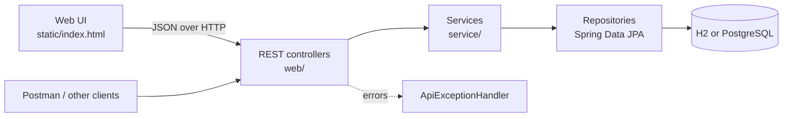
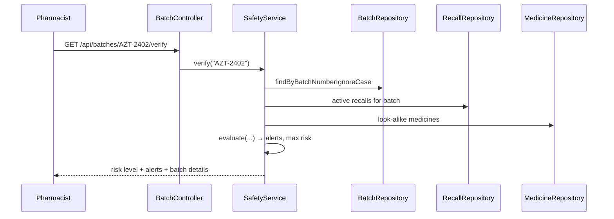

# Architecture

PharmaSafe is a layered Spring Boot application.



| Layer | Responsibility | Rule |
|---|---|---|
| Controller | HTTP: paths, parameters, status codes, validation | No business logic |
| Service | Safety rules, recall impact, availability ranking | No HTTP types |
| Repository | Database queries | No business rules |
| Model | JPA entities | Plain data + constructors |

DTOs (Java `record`s in `web/dto/Dtos.java`) are returned instead of entities. This keeps the JSON stable and avoids lazy-loading surprises.

## Data model

```mermaid
erDiagram
    MEDICINE ||--o{ BATCH : "has"
    BATCH ||--o{ INVENTORY_ITEM : "stocked as"
    PHARMACY ||--o{ INVENTORY_ITEM : "holds"
    BATCH ||--o{ RECALL : "may have"

    MEDICINE { long id; string brandName; string genericName; string strength; string dosageForm; string manufacturer; string lookAlikeGroup }
    BATCH { long id; string batchNumber; date manufactureDate; date expiryDate; string supplier; enum status }
    PHARMACY { long id; string name; string area; string city; string phone }
    INVENTORY_ITEM { long id; int quantity; datetime updatedAt }
    RECALL { long id; string reason; enum severity; string issuedBy; date issuedOn; bool active }
```

`InventoryItem` is the link between a pharmacy and a batch, with a quantity. There is one row per (pharmacy, batch) pair, enforced by a unique constraint.

## Main flows

### 1. Batch verification



`SafetyService.evaluate` is a static, pure function (no database). That is why it can be unit-tested directly in `SafetyServiceTest`.

### 2. Recall response

`POST /api/recalls` validates the request and returns 404 if the batch is unknown or 409 if the batch already has an active recall. Otherwise it saves the recall and sets the batch status to `RECALLED`. Both writes happen in one transaction. The response contains the impact straight away: the affected pharmacies, the unit count and the recommended actions.

Because the batch is now `RECALLED`, it automatically:
- shows `HIGH_PRIORITY` in verification,
- disappears from availability search,
- counts toward "units in recalled batches" on the dashboard.

### 3. Availability search

A single JPQL query (`InventoryItemRepository.findDispensableStock`) returns stock where:
- the brand or generic name matches,
- the batch status is `ACTIVE`,
- the expiry date is after today,
- the quantity is above 0.

The service groups the rows by pharmacy and sorts each pharmacy's batches by earliest expiry (FEFO). It then puts pharmacies in the preferred area first, followed by the ones with the most units.

## Design decisions

- **Injectable `Clock`.** Every "today" comes from a `Clock` bean, so tests can fix the date and expiry logic is predictable.
- **Relative sample dates.** `DataSeeder` builds dates from today, so the "expired" and "expiring soon" demos work on any day.
- **H2 by default, PostgreSQL by profile.** Anyone can clone the repo and run it with zero setup, while the same code runs on PostgreSQL in Docker.
- **Risk levels, not verdicts.** The system never says "fake" or "safe". It says how urgently the pharmacist should look.
